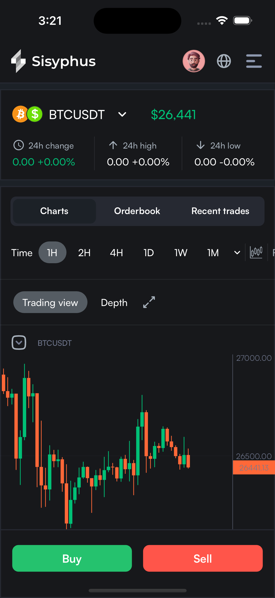
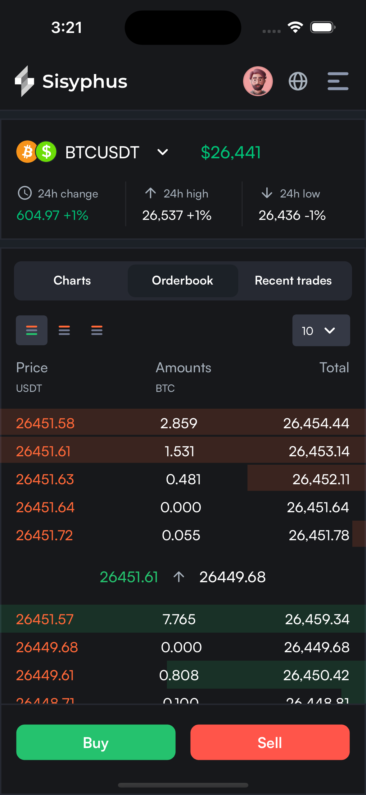
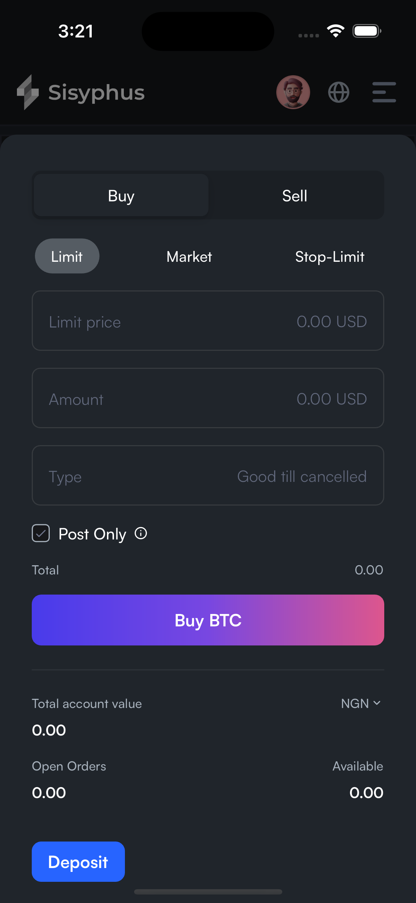
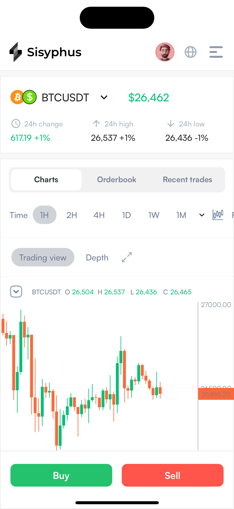
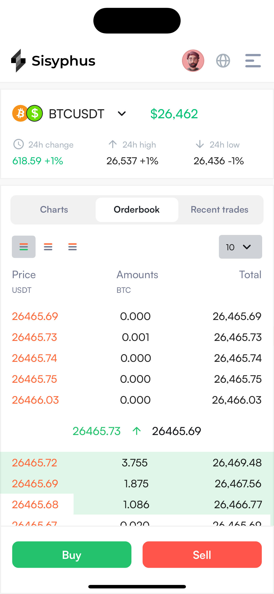
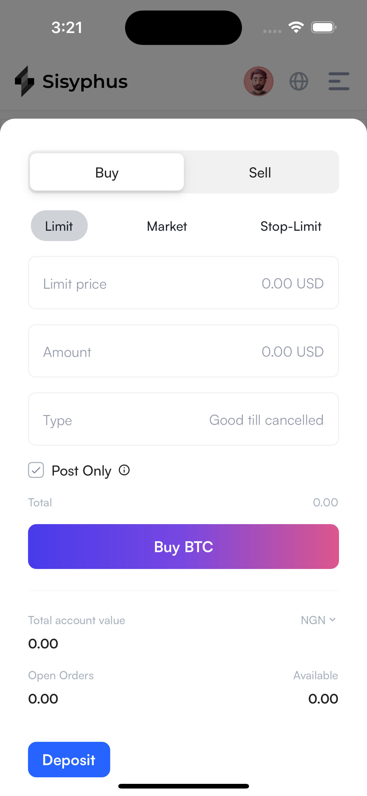

# Sisyphys App

Sisyphus app built with the Flutter framework and Binance Websockets API

## Tools used in building

- flutter_hooks `internal state`
- hooks_riverpod `state management`
- flutter_svg `svg images`
- intl `internalization`
- gap `sizedbox replacement`
- http `API calls and networking`
- web_socket_channel `web sockets`
- candlesticks `candlesticks ui`
- flutter `v3.10 - mobile sdk`

## App screenshots

